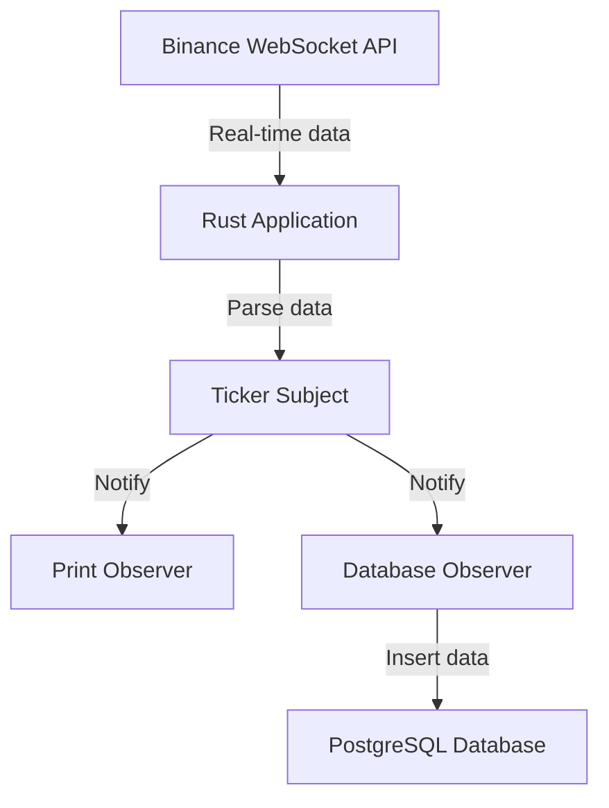
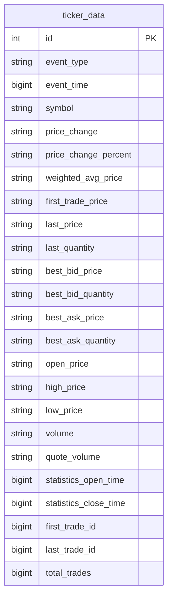

[](https://github.com/arturogonzalezm/binance_ticker_rust/actions/workflows/workflow.yml)
[](https://opensource.org/licenses/MIT)

# Binance Ticker

This project is a Rust-based application that connects to the Binance WebSocket API to collect real-time ticker data for a specific cryptocurrency pair (e.g., BTCUSDT). It then stores this data in a PostgreSQL database for further analysis or processing.

## High-Level Design

The application follows the Observer pattern and uses asynchronous programming to handle WebSocket connections and database operations efficiently. Here's a high-level overview of the system:



## Components

1. **WebSocket Client**: Connects to Binance API and receives real-time ticker data.
2. **Ticker Parser**: Parses incoming JSON data into Ticker structs.
3. **Observer Pattern Implementation**: Allows for flexible handling of ticker data.
4. **PostgreSQL Integration**: Stores ticker data in a database for persistence.
5. **Docker Setup**: Provides easy deployment and database setup.

## Setup and Installation

### Prerequisites

- Rust (latest stable version)
- Docker and Docker Compose

### Steps

1. Clone the repository:
   ```
   git clone https://github.com/arturogonzalezm/binance_ticker_rust.git
   cd https://github.com/arturogonzalezm/binance_ticker_rust.git
   ```

2. Set up environment variables:
   Create a `.env` file in the project root with the following content:
   ```
   DB_USER=postgres
   DB_PASSWORD=postgres
   DB_NAME=postgres
   ```

3. Start the PostgreSQL database using Docker Compose:
   ```
   docker-compose up -d
   ```

4. Build and run the Rust application:
   ```
   cargo build --release
   cargo run --release
   ```

## Database Schema

The application uses a single table to store ticker data:



## How It Works

1. The application establishes a WebSocket connection to the Binance API for a specific trading pair.
2. It receives real-time ticker data and parses it into `Ticker` structs.
3. The `TickerSubject` notifies registered observers (e.g., `PrintObserver` and database insertion) about new ticker data.
4. Ticker data is inserted into the PostgreSQL database for storage and later analysis.
5. The application maintains the WebSocket connection and handles reconnection if necessary.

## Project Structure

```
.
├── Cargo.toml
├── docker-compose.yml
├── database/
│   └── init.sql
└── src/
    ├── main.rs
    ├── observer.rs
    └── ticker.rs
```

- `main.rs`: Contains the main application logic, WebSocket handling, and database insertion.
- `observer.rs`: Implements the Observer pattern for flexible data handling.
- `ticker.rs`: Defines the `Ticker` struct and its serialization/deserialization.

## Future Improvements

1. Implement error handling and reconnection logic for better resilience.
2. Add more observers for different types of data processing or alerting.
3. Implement a configuration file for easier customization of trading pairs and other settings.
4. Add unit and integration tests to ensure reliability.
5. Implement data aggregation and analysis features.

## Contributing

Contributions are welcome! Please feel free to submit a Pull Request.

## License

This project is open-source and available under the [MIT License](LICENSE).
